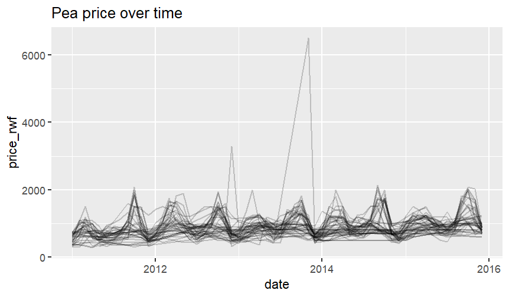
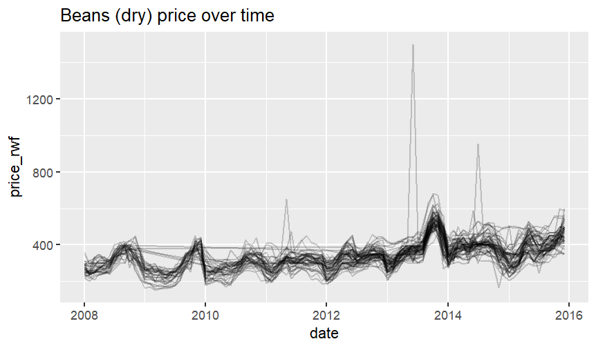

# Food-Price-Forecast

## About

Exploring food pricing trends in Rwanda, agriculture accounts for 30% of Rwanda's economy and over 60% of its export earnings.

In this project we create forecasting functions to automate the projections of food prices.

Skills Showcased:

-   Data Analysis
-   R Coding
-   Forecasting

[View more projects like this!](https://cian-murray-doyle.github.io/)

## Libraries Overview

The following R libraries will be used for this project.

``` r
# Install packages
install.packages(c("readr", "dplyr", "lubridate", "ggplot2", "magrittr", "forecast"))

# Load the packages
library(readr)
library(dplyr)
library(lubridate)
library(ggplot2)
library(magrittr)
library(forecast)
```

First we load our initial dataset in, we can see there are many irrelevant data that provide no insights as well as columns that are not clearly labelled. So we will remove any irrelevant data and rename any unclear labels.


The year and month are given as integers, before we can begin our analysis we need to convert these to a date data type.


In order to leverage this code to analysis more than just one dataset we are going to wrap our code so far into a function, that will allow for us to simply plug in a dataset without altering any code.

``` r
read_price_data <- function(commodity) {
  data_file <- paste0("datasets/", commodity, ".csv")
  prices <- read_csv(
    data_file,
    col_types = cols_only(
      adm1_name = col_character(),
      mkt_name = col_character(),
      cm_name = col_character(),
      mp_month = col_integer(),
      mp_year = col_integer(),
      mp_price = col_double()
    )
  )
  
  prices_renamed <- prices %>% 
    rename(
      region = adm1_name, 
      market = mkt_name,
      commodity_kg = cm_name,
      month = mp_month,
      year = mp_year,
      price_rwf = mp_price
    )
    
  prices_renamed %>% 
    mutate(
      date = ymd(paste(year, month, "01"))
    ) %>% 
    select(-month, -year)
}
```

Next we want to create functions we can call upon to automatically graph the cleaned data from the above function. Firstly, we will create a function that will graph price trends over time.

``` r
plot_price_vs_time <- function(prices, commodity) {
  prices %>% 
    ggplot(aes(date, price_rwf, group = market)) +
    geom_line(alpha = 0.2) +
    ggtitle(paste(commodity, "price over time"))
}
```




Now we will look to forecast food prices, the dataset contains multiple time series across multiple markets, as we seen before there are some very large spikes. So for our analysis we will opt to take the median price across these markets rather than the mean.

Next, to carry out our forecasting in R we need to convert our data to a timeseries object. Once these are done we will transform the code into a function that can be called upon to use with any of our datasets.

``` r
create_price_time_series <- function(prices) {
  prices_summarized <- prices %>%
    group_by(date) %>% 
    summarize(median_price_rwf = median(price_rwf))
  
  prices_summarized %$% 
    ts(
      median_price_rwf, 
      start = c(year(min(date)), month(min(date))), 
      end   = c(year(max(date)), month(max(date))), 
      frequency = 12
    )
}
```

Now we can create a function to forecast the future prices for our data, we can assess the accuracy of these forecasts by looking at our previous analysis. We seen that there was clear seasonality in food pricing, so we should expect to see this repeated in our forecasting.

``` r
plot_price_forecast <- function(time_series, commodity) {
  price_forecast <- forecast(time_series)
  autoplot(price_forecast, main = paste(commodity, "price forecast")) 
}
```


No we have our functions created we can quickly and easily carry out this forecasting on any of our datasets.




